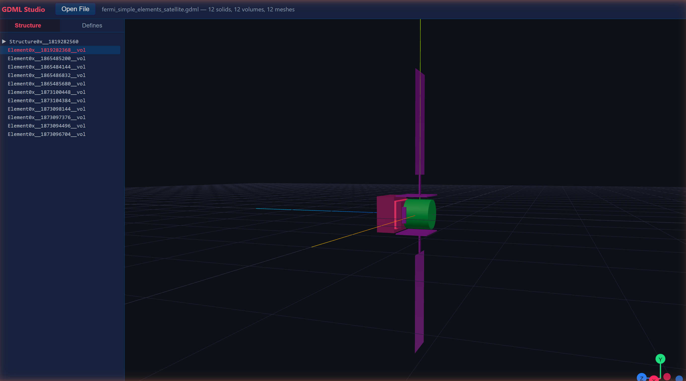

# GDML Studio

> **Early-stage project** — This is a fresh prototype under active development. It likely does not fully work yet. Expect rough edges, missing features, and bugs. Contributions and bug reports are welcome.

A lightweight desktop tool for viewing [GDML](https://gdml.web.cern.ch/GDML/) (Geometry Description Markup Language) detector geometry files. GDML is the standard geometry format used by [Geant4](https://geant4.web.cern.ch/) and other particle-physics simulation frameworks. GDML Studio lets you quickly inspect these geometries without launching a full Geant4 session — it parses the GDML XML, evaluates expressions and units, tessellates solids into triangle meshes, and renders the 3D scene in the browser.

<p align="center">
  
</p>

## Architecture

| Layer | Tech | Path |
|-------|------|------|
| Backend | Rust / Axum | `backend/` |
| Frontend | React / Three.js (via React Three Fiber) | `frontend/` |

The backend exposes a REST API that the frontend consumes. Communication is JSON over HTTP.

## Prerequisites

- **Rust** stable toolchain — [install via rustup](https://rustup.rs/)
- **Node.js** v18+ and **npm** — [install from nodejs.org](https://nodejs.org/)

## Quick Start

### 1. Clone the repository

```bash
git clone git@github.com:davsar89/GDML_Studio.git
cd GDML_Studio
```

### 2. Start the backend

```bash
cd backend
cargo run --release
```

The backend compiles and starts an HTTP server on `http://127.0.0.1:3001`.
On the first run, Cargo will download and compile all dependencies (this may take a minute or two).

### 3. Start the frontend (in a separate terminal)

```bash
cd frontend
npm install      # only needed on first run
npm run dev
```

Vite will print a local URL (typically `http://localhost:5173`).

### 4. Use the application

Open the Vite URL in your browser, click **Open File**, and provide the **absolute path** to a `.gdml` file (e.g. one of the sample files below).

## Sample Files

Three GDML files are included in `sample_data/` for quick testing:

| File | Size | Description |
|------|------|-------------|
| `sample_data/BgoDetModel_v2_00.gdml` | 158 KB | BGO detector model |
| `sample_data/NaiDetModelWithMLI_v2_00.gdml` | 167 KB | NaI detector model with MLI |
| `sample_data/fermi_simple_elements_satellite.gdml` | 7.7 KB | Fermi satellite simple geometry |

## Running Tests

```bash
# Backend integration tests (from project root)
cargo test

# Frontend type check
cd frontend
npx tsc --noEmit
```

## License

See individual files for details.
