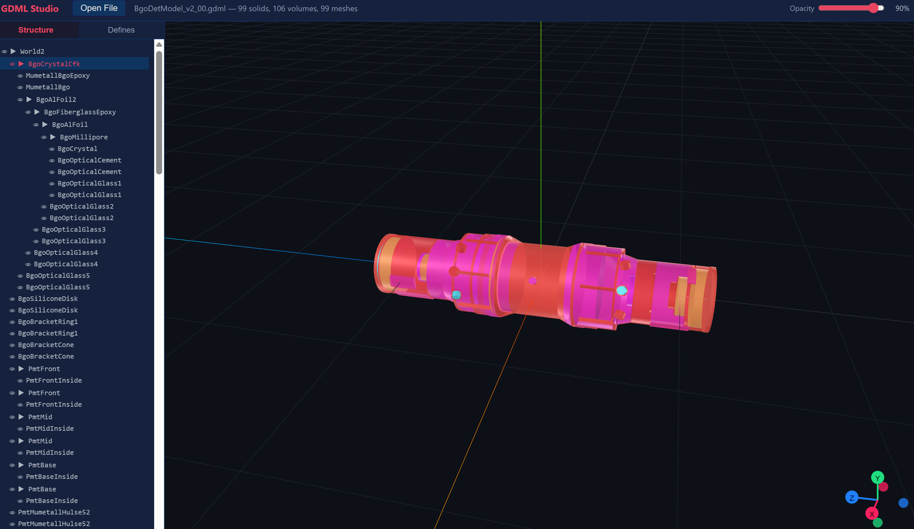

# GDML Studio

> **Early-stage project** — This is a fresh prototype under active development. It likely does not fully work yet. Expect rough edges, missing features, and bugs. Contributions and bug reports are welcome.

A lightweight desktop tool for viewing [GDML](https://gdml.web.cern.ch/GDML/) (Geometry Description Markup Language) detector geometry files. GDML is the standard geometry format used by [Geant4](https://geant4.web.cern.ch/) and other particle-physics simulation frameworks. GDML Studio lets you quickly inspect these geometries without launching a full Geant4 session — it parses the GDML XML, evaluates expressions and units, tessellates solids into triangle meshes, and renders the 3D scene in the browser.

<p align="center">
  
</p>

## Architecture

| Layer | Tech | Path |
|-------|------|------|
| Backend | Rust / Axum | `backend/` |
| Frontend | React / Three.js (via React Three Fiber) | `frontend/` |

The backend exposes a REST API that the frontend consumes. Communication is JSON over HTTP.

## Prerequisites

- **Rust** stable toolchain — [install via rustup](https://rustup.rs/)
- **Node.js** v20.19+ or v22.12+, and **npm** — [install from nodejs.org](https://nodejs.org/)
  (required by Vite 7; on Node 18 `npm install` only warns and the dev server then fails)

## Quick Start

### 1. Clone the repository

```bash
git clone git@github.com:davsar89/GDML_Studio.git
cd GDML_Studio
```

### 2. One-command start (recommended)

Scripts that build the backend, run tests, start both servers, and open the browser.
The scripts check for prerequisites first and will tell you exactly what to install if anything is missing.

```bash
# Linux / macOS
./run.sh

# Windows
run.bat
```

### 3. Manual start

**Backend** (terminal 1):

```bash
cd backend
cargo run --release
```

The backend compiles and starts an HTTP server on `http://127.0.0.1:4001`.
On the first run, Cargo will download and compile all dependencies (this may take a minute or two).

**Frontend** (terminal 2):

```bash
cd frontend
npm install      # only needed on first run
npm run dev
```

Vite will print a local URL (typically `http://localhost:5173`).

### 4. Use the application

Open the Vite URL in your browser, click **Open File**, and select a `.gdml` file (e.g. one of the sample files below).

### Material Editor

The **Materials** tab in the left panel lists all materials and elements defined in the loaded GDML file. Select a material to edit its properties:

- **Density** — edit the numeric value and choose a unit (g/cm3, kg/m3, mg/cm3)
- **Formula** — set or clear the chemical formula
- **Z** — set or clear the atomic number (for simple materials)
- **Components** — add or remove element references with fraction or composite weights
- **Auto-rename** — when you change a material's formula, GDML Studio offers to rename the material to match

Use the **NIST Material Lookup** button to search the built-in database of 309 Geant4 predefined materials (elemental, compound, HEP, space, and biochemical categories) and apply a NIST density to the selected material.

### Volume Material Assignment

Select a volume in the 3D scene or tree view to open the **Volume Detail** panel. Use the material dropdown to reassign which material a volume references.

### Save / Export

The toolbar provides two export options. Both **download** a GDML file through
the browser — neither writes to the file you opened, and the backend never
touches your filesystem. Your original file on disk is left untouched.

- **Save** — downloads the current state (materials, elements, volumes) using the original filename
- **Save As** — same, but prompts for the filename first

Because these are ordinary browser downloads, they land in your download
directory, and your browser will typically rename rather than replace an
existing file (`model (1).gdml`). To update the original, move the downloaded
file over it yourself.

## Sample Files

GDML files are included in `sample_data/` for quick testing:

| File | Size | Description |
|------|------|-------------|
| `sample_data/BgoDetModel_v2_00.gdml` | 160 KB | BGO detector model |
| `sample_data/NaiDetModelWithMLI_v2_00.gdml` | 169 KB | NaI detector model with MLI |
| `sample_data/solids.gdml` | 15 KB | Widest solid-type coverage |
| `sample_data/pinhole_lab.gdml` | 13 KB | Boolean/CSG-heavy geometry with nested replicas |
| `sample_data/pod_asm.gdml` | 12 KB | POD assembly |
| `sample_data/fermi_simple_elements_satellite.gdml` | 7.6 KB | Fermi satellite simple geometry |
| `sample_data/test_all_features.gdml` | 6.5 KB | Test file exercising all solid types |
| `sample_data/test_modular_mother.gdml` | 1.4 KB | Multi-file `<file>`-inclusion demo (with `test_modular_child.gdml`) |
| `sample_data/pod_asm_tessellated.gdml` | **6.7 MB** | Tessellated POD assembly, 44,408 facets — slow to load |

See [`sample_data/README.md`](sample_data/README.md) for the full list and file provenance.

## Running Tests

```bash
# Backend tests
cd backend
cargo test

# Frontend type check, lint and tests
cd frontend
npx tsc -b
npm run lint
npm test
```

> `tsc -b` (build mode) is required, not `tsc --noEmit`. `tsconfig.json` is a
> solution-style config (`"files": []` plus project references), so a non-build
> invocation resolves zero input files, checks nothing, and exits 0 regardless of
> how many type errors exist.

Frontend tests run under Vitest in jsdom. They deliberately cover no `Viewport/`
code — three.js needs a WebGL context jsdom does not provide — so the 3D
rendering path is still only verified by loading a file in the browser.

## License

See individual files for details.
